# YPrompt

AI通过对话挖掘用户需求，并自动生成专业的提示词，支持系统/用户提示词优化、效果对比，版本管理和支持即时渲染的操练场，新增通过多轮对话绘图改图，图片逆推提示词、绘图提示词优化

## 功能特性

- AI引导对话挖掘用户需求后生成专业系统提示词
- 系统/用户(支持构建对话上下文)优化、效果对比
- 提示词版本管理与历史回滚
- 操练场支持多种输出类型即时渲染，效果看得见
- 多认证：Linux.do OAuth、飞书 OAuth、本地用户名密码
- 双数据库：SQLite（默认）+ MySQL（可选）
- 响应式设计（桌面/移动端）
- 新增绘图功能（实验），暂时没保存配置入数据库
  - 多轮对话生图、改图
  - 支持拖拽上传图片、拖拽调整图片附件顺序，图片附件预览
  - 支持并发生成1-4张图片
  - 支持提示词翻译
  - 右侧生成结果区可以对图片预览、下载、删除，可以查看详细参数和提示词
  - 图片逆推提示词、质量分析、提示词优化

## 界面

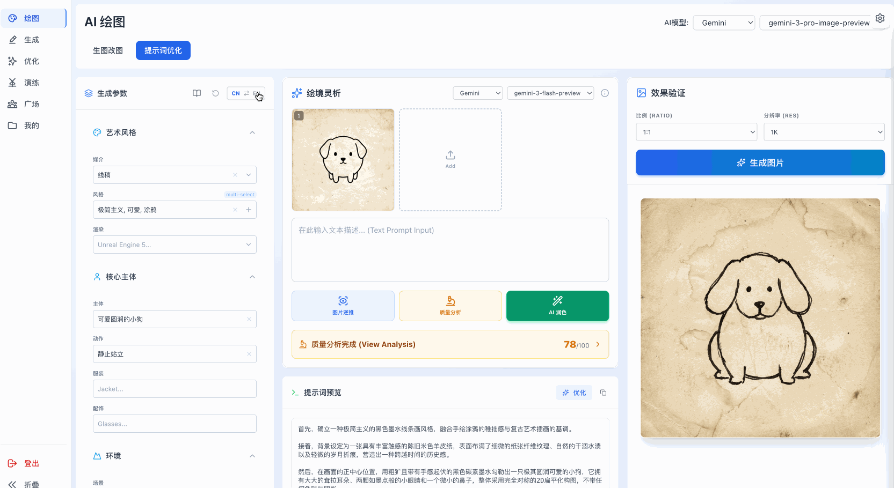
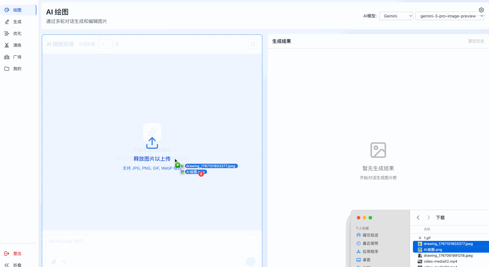
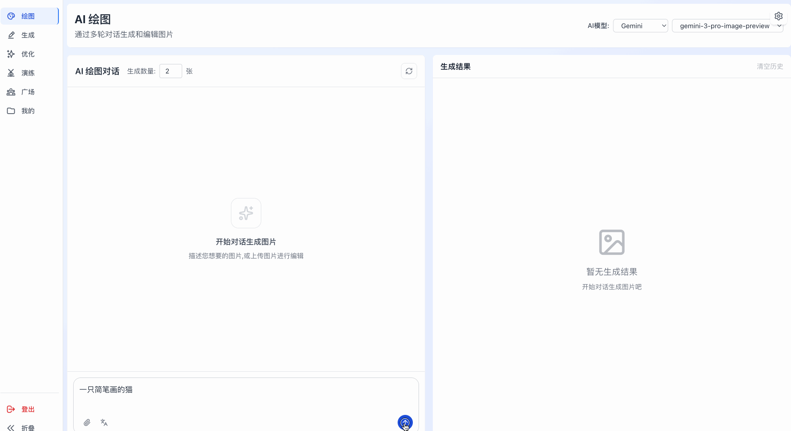
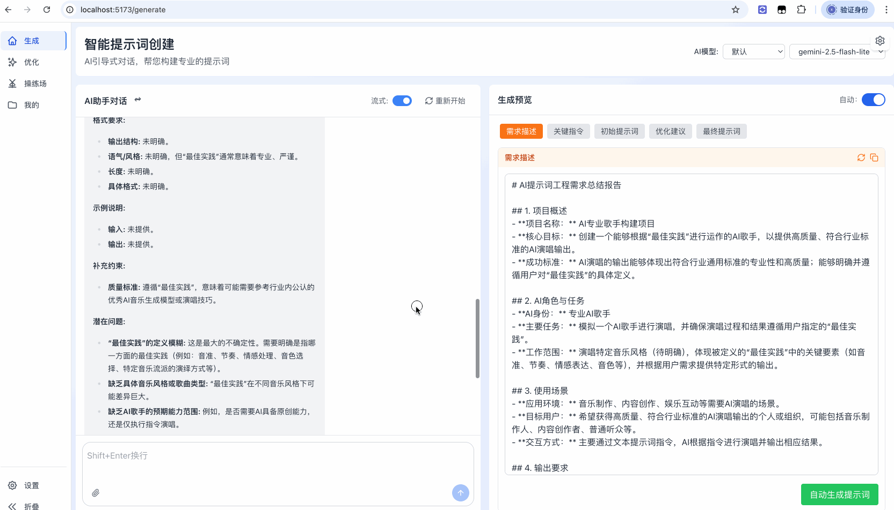
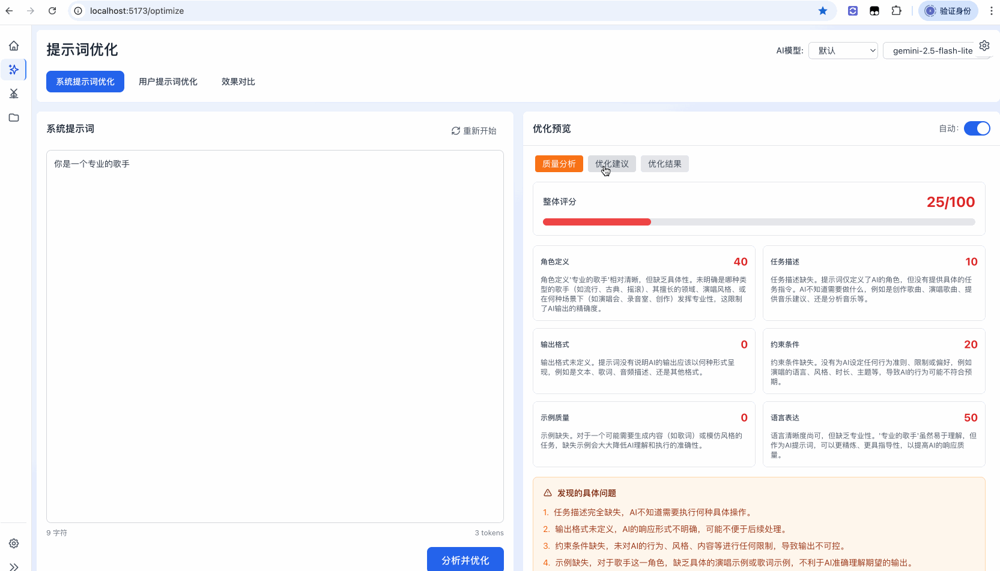
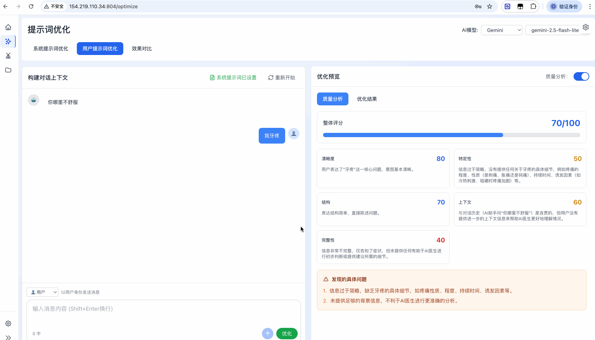
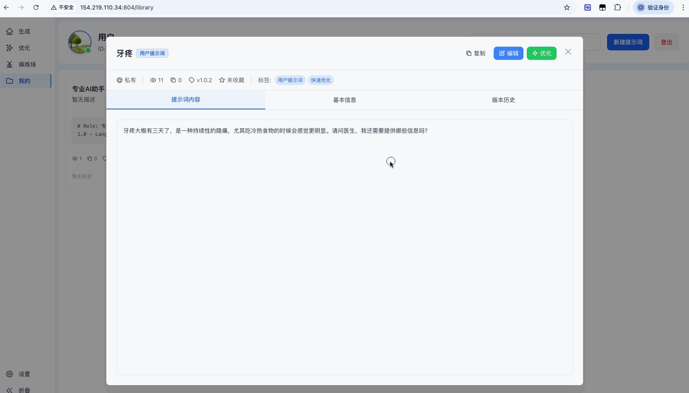
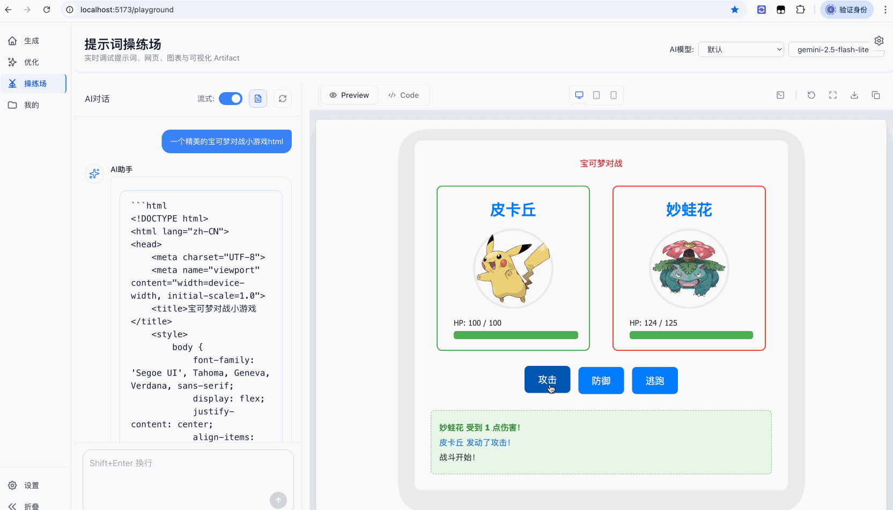
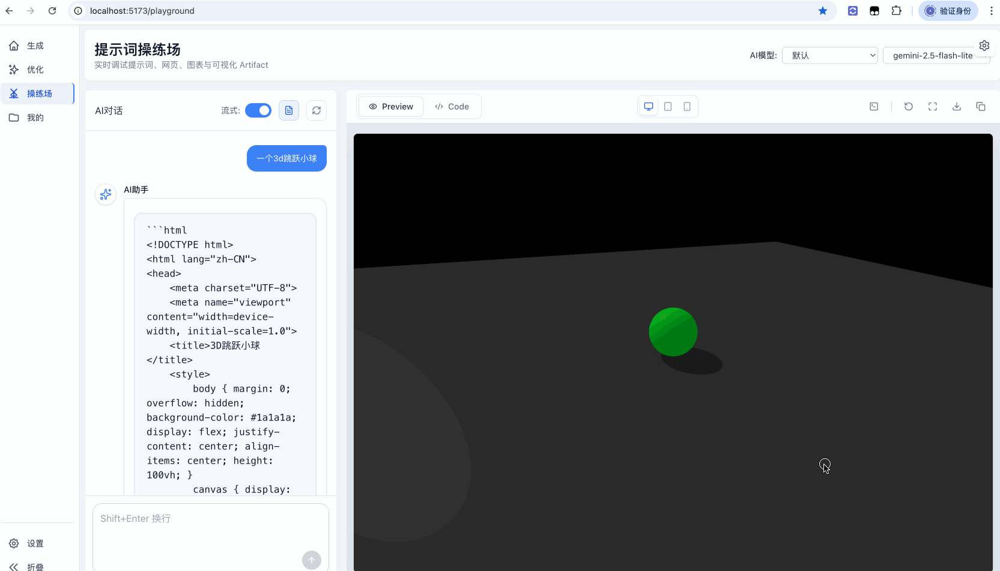
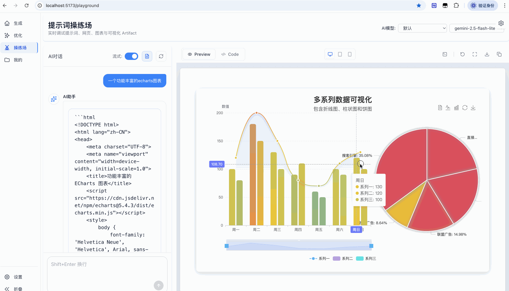
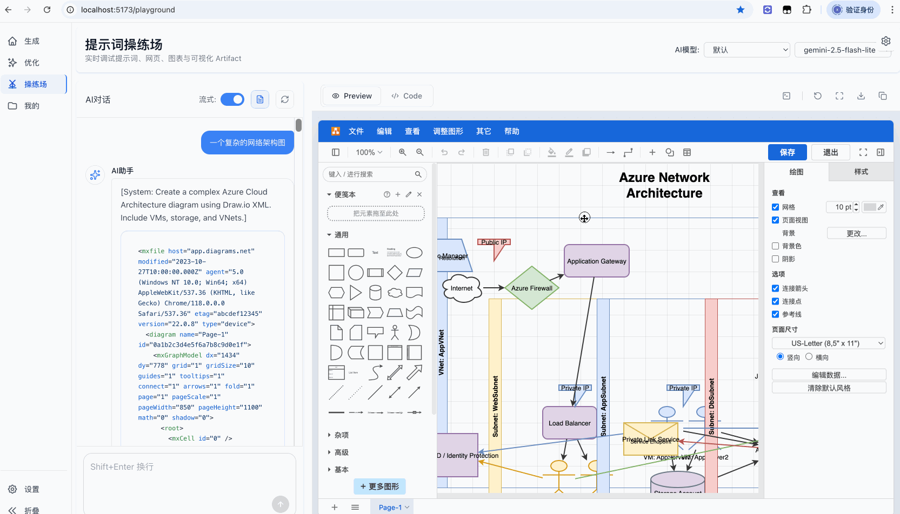
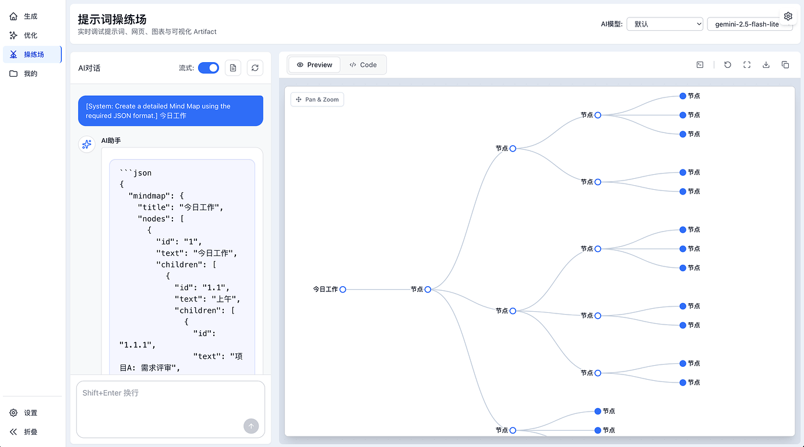
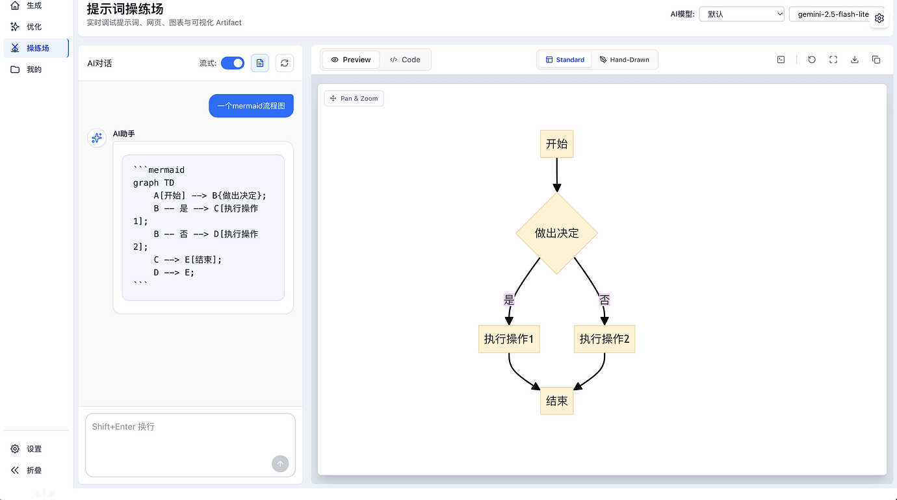
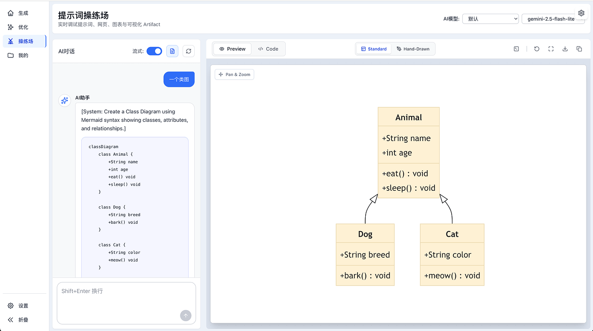

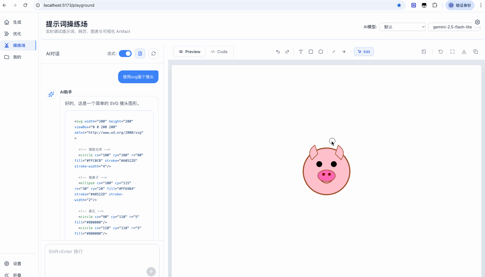
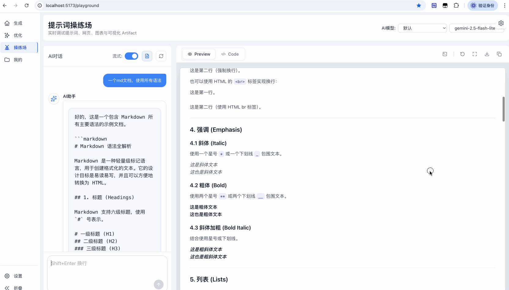
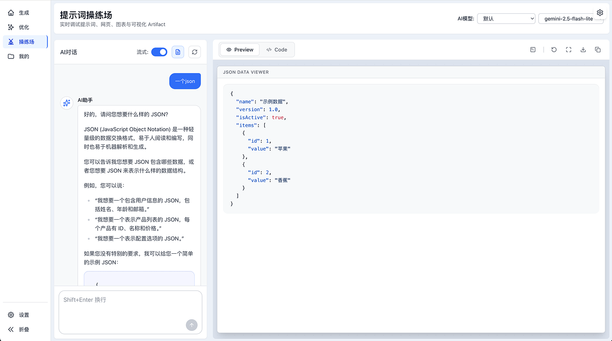
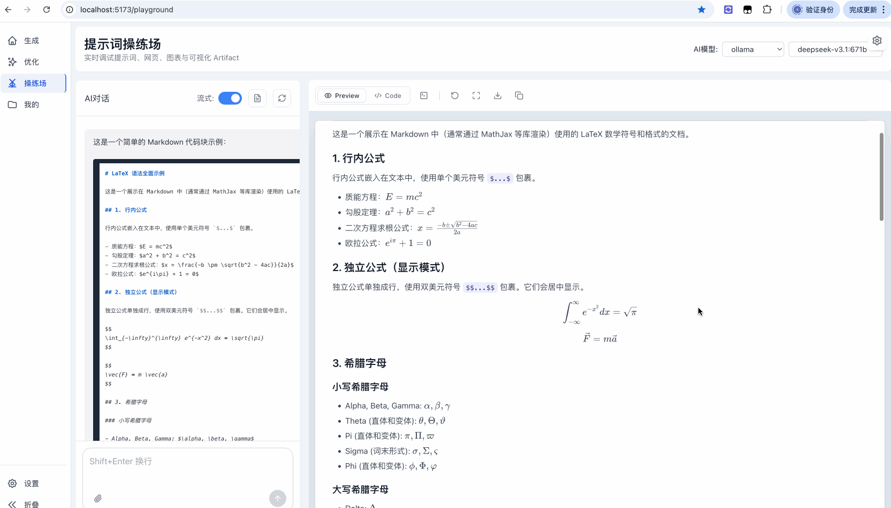

## 许可证

本项目采用 [CC BY-NC-SA 4.0](LICENSE) 许可证。

- 禁止任何形式的商业使用
- 允许个人学习和非商业用途
- 衍生作品必须使用相同许可证
- 二次开发必须注明原项目地址
